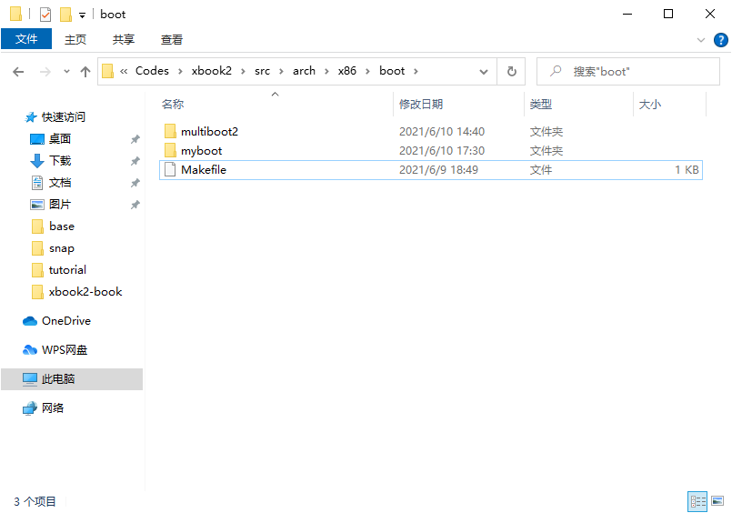
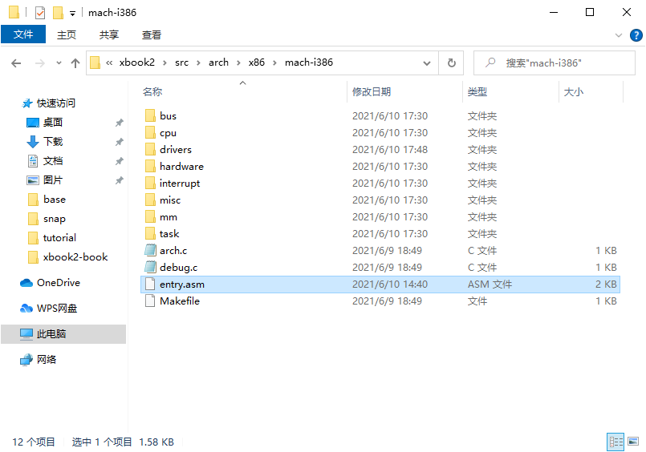
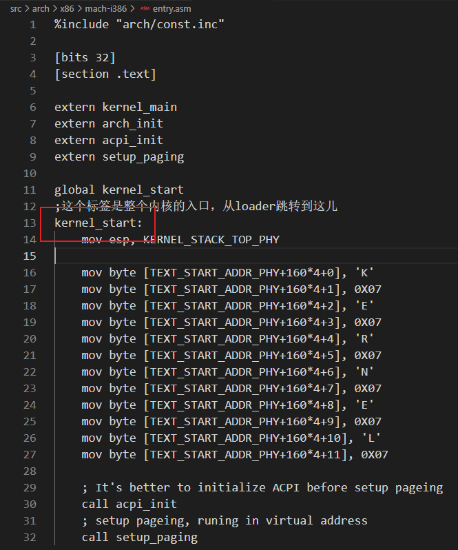
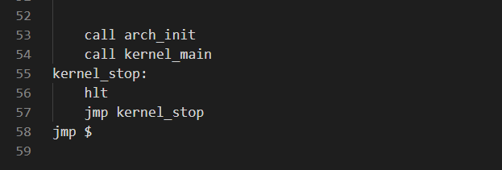
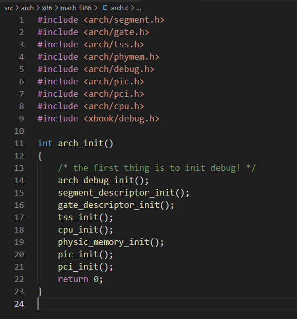
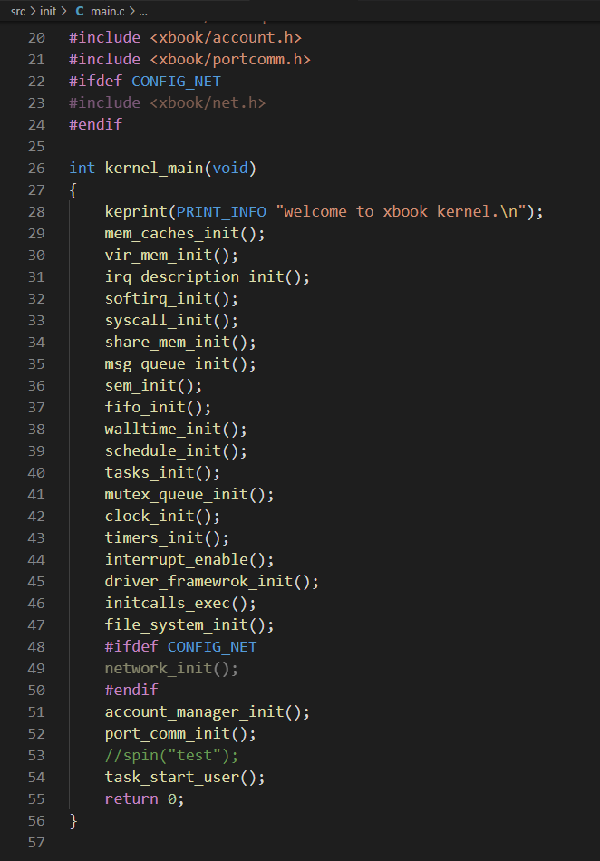
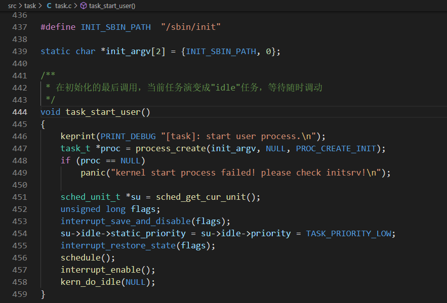
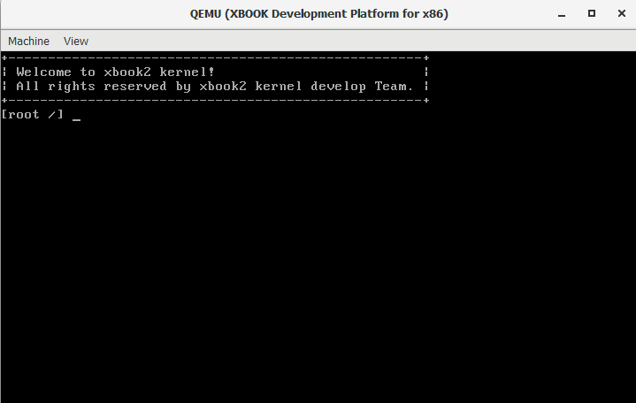

# 内核基础

本章介绍xbook2的内核基础，包括：内核简介、内核的启动流程以及配置部分，为后面的章节奠定基础。看完后能让开发者对内核有一个大体的了解，对它不再陌生。

## xbook2 内核介绍

xbook2 内核是类unix风格的系统内核，很多内容参考了开源的linux内核的设计，于此同时，也参考了windowsNT内核以及其它内核的设计与实现。内存管理，中断管理主要参考了linux，IO驱动管理参考了windowsNT内核，其它模块大多数是我们自己开发。

xbook2内核的内容包括：x86处理器相关代码、物理内存和虚拟内存管理、多任务管理、驱动框架、文件系统、网络系统、图形驱动系统、IPC系统、时间管理系统等。内核最小需要的300MB内存支持。

## 任务调度

任务是xbook2内核中最小的调度单位，任务调度算法是基于优先级和时间片的调度算法。支持4个优先级，分别是LOW,NORMAL,HIGH,REALTIME这4个优先级，LOW是最低的优先级，idle任务就是在这个优先级中，NORMAL是用户任务运行的优先级，HIGH是对一些要求更高的任务的优先级，REALTIME是阻塞式驱动任务使用的优先级。相同的优先级的任务是基于时间片轮转进行调度的，调度器总是获取优先级最高的任务来进行调度。

任务管理将在[《任务管理》](../task/task.md)章节详细介绍。

## 时钟管理

xbook2 的时钟管理是以ticks时钟节拍为基础，时钟节拍是xbook2中最小的时钟单位。xbook2的定时器是单次触发的，就是定时器超时后系统会自动将其删除，如果还想要再次产生超时，则需要重新设置超时时间。

通常使用定时器回调函数（即超时函数），完成定时器服务。

定时器将在[《时间管理》](../timer/timer.md)章节展开讲解。

## 内存管理

xbook2 内存管理基于memnode物理内存池、memchache虚拟内存和memspace内存空间来构建。从内核内存到进程内存实现了一套有关联的管理模式。除此之外，采用了分页内存管理，可以实现进程空间隔离效果，从而达到进程和内核互不干扰。

内存管理将在[《内存管理》](../mm/mm.md)章节展开讲解。

## I/O设备管理

xbook2 驱动框架采取了windowsNT式的驱动框架，其目的在于让人了解到不同的驱动实现方式。在这个框架下面，分成了driver对象和device对象，一个driver对象对应着多个device对象。同时也支持open、close、read、write、ioctl接口框架。

I/O设备管理将在[《设备模型》](../device/device.md)章节展开讲解。

## 文件系统

xbook2 采用了unix风格的文件管理方式，以fsal为基础，在此基础上实现不同类型的文件系统。目前支持了fatfs文件系统，dev设备文件，pipe管道文件，socket套接字接口。

文件系统将在[《文件系统》](../fs/fs.md)章节展开讲解。

## 网络系统

xbook2 采用了开源的网络协议栈lwip，基于该协议栈，只需要支持网卡驱动，以及对上层接口进行一定的封装，即可投入到使用当中。

网络系统将在[《网络系统》](../net/net.md)章节展开讲解。

## xbook2 启动流程

xbook2 启动时，需要有引导程序来做最基础的初始化，然后再跳转到内核中执行。

目前我们支持的引导有2种，一种是我们自己写的引导，基于软盘来的，简单快速。一种是基于grub（multiboot2）的引导，比较强大。x86处理器先是进入16位模式执行，需要通过代码执行后，进入32位模式，两种引导方式都实现了相同的功能，引导会把内核程序加载到内存中，并在最后跳转如内核执行。你可以在`xbook2/Makefile`中修改`BOOT_MODE`变量来切换引导方式。



内核的入口程序在`xbook2/src/arch/x86/mach-i386/entry.asm`中。内核的入口程序在kernel_start这个标签处，这个地方是内核最开始执行的代码，如果是grub引导，就还需要在其它地方做一定的处理后再跳转过来。






然后会调用`arch_init`来进行一些和处理器相关的初始化，然后跳转到`kernel_main`中执行一些平台无关的程序。



arch相关的初始化位于`xbook2/src/arch/x86/mach-i386/arch.c`中。在里面进行一些平台相关的初始化。




当完成了arch的初始化，就会跳转到`kernel_main`中执行。位于`xbook2/src/init/main.c`中。



完成所有初始化后，会通过`task_start_user`去执行第一个进程。该程序位于`xbook2/src/task/task.c`中



在这里面，会先创建一个进程，让该进程去执行`/sbin/init`这个程序，然后进行schedule调度，就会调度到其它任务执行了。

至此，内核就完成了初始化，并且启动了用户程序。`/sbin/init`程序会启动一个shell，然后我们就可以通过这个shell和内核进行交互了。



## xbook2 内核配置示例

内核头文件配置：`xbook2/src/include/xbook/config.h`

```c
/* 配置处理器位宽 */
#define CONFIG_32BIT
/* config large alloc size in memcache */
#define CONFIG_LARGE_ALLOCS
```

Makefile配置：`xbook2/Makefile`

```
# set default boot mode (BOOT_GRUB2_MODE / BOOT_LEGACY_MODE)
export BOOT_MODE ?= $(BOOT_GRUB2_MODE)

# is qemu fat fs? (y/n)
QEMU_FAT_FS ?= n

# has net module? (y/n)
KERN_MODULE_NET	?= n
```

myboot图形模式配置：`xbook2/src/arch/x86/boot/myboot/loader.asm`

```
; 启动图形模式
%define CONFIG_GRAPHIC_ENABLE
```

grub图形模式配置：`xbook2/src/arch/x86/boot/multiboot2/multiboot2.S`

```
# 启动图形模式
#define CONFIG_GRAPHIC_ENABLE
```

