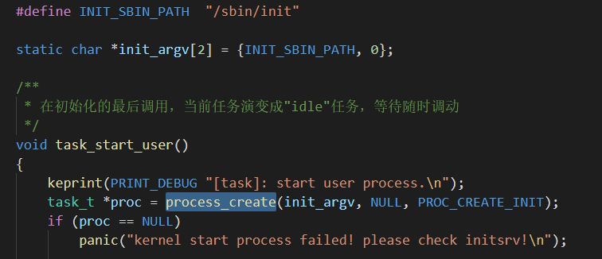

# 任务管理

在xbook2中，任务是最小的调度单元，它可以是一个内核线程，也可以是一个进程，甚至是一个用户态线程，这取决于它使用的资源的情况。

xbook2目前仅仅支持单处理器，那么多任务的实现就是在一个处理器上面，快速的切换当前执行流，从而实现多个任务“同时”运行的现象。

## 多任务的工作机制

### 任务结构体

每个任务都有一个任务结构体，结构体包含了最基础的信息，比如状态、pid、name、优先级等，也有任务链表，以及其它成员，详细定义如下：

```

typedef struct {
    unsigned char *kstack;              /* kernel stack, must be first member */
    task_state_t state;
    spinlock_t lock;                    /* 操作task成员时需要进行上锁 */
    cpuid_t cpuid;
    pid_t pid;                          /* process id */
    pid_t parent_pid;
    pid_t tgid;                         /* 线程组id：线程属于哪个进程，和pid一样，就说明是主线程，不然就是子线程 */
    pid_t pgid;                         /* 进程组ID：用于终端控制 */
    unsigned long flags;                
    char priority;             /* 任务的动态优先级 */
    char static_priority;      /* 任务的静态优先级 */
    unsigned long ticks;                /* 运行的ticks，当前剩余的timeslice */
    unsigned long timeslice;            /* 时间片，可以动态调整 */
    unsigned long elapsed_ticks;        /* 任务执行总共占用的时间片数 */
    unsigned long syscall_ticks;        /* 执行系统调用总共占用的时间片数 */
    clock_t syscall_ticks_delta;  /* 执行单个系统调用占用的时间片数 */
    int exit_status;                    
    char name[MAX_TASK_NAMELEN];        
    struct vmm *vmm;                    
    list_t list;                        /* 处于所在队列的链表，就绪队列，阻塞队列等 */
    list_t global_list;                 /* 全局任务队列，用来查找所有存在的任务 */
    exception_manager_t exception_manager;         
    timer_t sleep_timer;               
    fpu_t fpu;
    alarm_t alarm;                      
    long errcode;                       /* 错误码：用户多线程时用来标记每一个线程的错误码 */
    pthread_desc_t *pthread;            /* 用户线程管理，多个线程共同占有，只有一个主线程的时候为NULL */
    file_man_t *fileman;    
    exit_hook_t exit_hook;  /* 退出调用的钩子函数 */
    void *exit_hook_arg;
    lpc_port_table_t port_table;
    port_comm_t *port_comm;
    struct tms times;
    unsigned int stack_magic;
} task_t;
```

### 任务的重要属性

#### 内核栈

目前任务的内核栈和任务用同一个内存地址。也就是分配任务的时候，会分配`TASK_KERN_STACK_SIZE`大小给task，然后内核栈栈顶就在`kstack + TASK_KERN_STACK_SIZE`这个位置。

#### 任务状态

任务状态用来描述任务目前处于哪种状态，在不同状态下面，任务有不同的行为。任务有就绪、执行中、阻塞、等待、停止、挂起、僵尸这7种状态。具体描述如下：

|           状态           |                             描述                             |
| :----------------------: | :----------------------------------------------------------: |
|  就绪状态（TASK_READY）  | 当任务被创建后，就会是就绪状态，然后会被添加到就绪队列上面，等待被调度。只要想要被执行，就得先处于就绪状态，才有机会得到执行。 |
| 运行状态（TASK_RUNNING） |            当前任务正在运行，处理器正在执行本任务            |
| 阻塞状态（TASK_BLOCKED） | 当因为IO或者其它原因不能运行时，就处于阻塞状态，需要解除阻塞，才能继续运行。 |
| 等待状态（TASK_WAITING） | 本状态是任务处于等待时的状态，比如等待子进程时，就是位于这个状态，需要子进程推出时被唤醒。 |
|  停止状态（TASK_STOP）   |  任务因为某种原因停止运行，和暂停一个意思，不是IO导致停止的  |
| 挂起状态（TASK_HANGING） | 当进程退出后，需要等待父进程来回收进程剩余的资源，就处于这个状态 |
| 僵尸状态（TASK_ZOMBIE）  |       进程退出的时候，父进程没有等待它，就处于僵尸状态       |

#### 任务的优先级

xbook2 采取了动态优先级的算法，优先级不是根据优先级数量来设置的，而实根据优先级等级，而优先级等级则是根据任务的类型来设定的。

关于优先级的描述如下：

|              优先级              |                             描述                             |
| :------------------------------: | :----------------------------------------------------------: |
|    低（TASK_PRIO_LEVEL_LOW）     | 最低的优先级，当没有跟高的优先级任务时，才会运行这里面的任务，一般都是idle任务 |
|  普通（TASK_PRIO_LEVEL_NORMAL）  | 这个优先级是大多数任务位于的优先级，用户态任务都是这个优先级 |
|    高（TASK_PRIO_LEVEL_HIGH）    | 高优先级，是NORMAL优先级的任务因为某些情况，需要紧急运行，就会进入到高优先级，执行完后，会动态的降低到NORMAL优先级 |
| 实时（TASK_PRIO_LEVEL_REALTIME） | 实时优先级是最高优先级，这个优先级的任务会最先运行，但是注意，这个优先级的任务必须是IO阻塞的，运行一会儿后就需要阻塞，不能死循环。 |

#### 时间片

时间片是根据ticks来计算的，每个任务会运行某个固定的时间片后，就会切换到其它任务。时间片越大，执行的时间越久，反之越短。

### 任务状态切换

任务创建后，会处于就绪(READY)状态，再添加到调度队列后，就可以被调度器调度了。当被调度后，就是处于执行(RUNNING)状态。在执行过程中，如果被时钟中断了，就会去调用调度器，然后切换到下一个任务，本任务处于就绪状态，添加到就绪队列中。下一个任务就处于运行中。

在执行过程中，如果调用了阻塞式的IO设备，则需要阻塞等待设备完成数据交互，此时处于阻塞（BLOCKED）状态，完成后，被唤醒，处于就绪状态。

当进程调用waitpid时，就会等待子进程完成，此时处于等待（WAITING）状态，当子进程退出后，就会唤醒自己，又变成就绪状态。

当因为某种原因，比如被要求暂停运行时，则处于停止（STOP）状态，然后等待被唤醒继续运行，又变成就绪状态。

当子进程退出时，就会变成挂起（HANGING）状态，等待父进程回收资源。资源回收后，子进程则会被释放，从此消失。

还有一种状态就是，子进程退出时，发现没有父进程等待自己，那么会变成僵尸（ZOMBIE）状态。

### 系统线程

在系统运行的过程中，会有一些守护线程，例如idle任务，就是为了保证至少会有一个任务运行。不然的花，处理器没任务调度，就会死机了。在目前的内核中，初始执行流，也就是boot开始执行的这个执行流会在最后演变成idle线程。

## 任务的管理方式

任务的基础操作包括：创建/退出、阻塞/解除阻塞、让出（yield）

### 创建和退出任务

创建一个任务：

```c
task_t *task_create(char *name, uint8_t prio_level, task_func_t *func, void *arg);
```

当调用该函数后，就会创建一个任务，如果成功则返回任务的指针，失败返回NULL，可以给任务指定name，并传入一个优先级，接着就是任务的执行函数和参数了。任务的函数结构如下：

```c
void task_demo(void *arg)
{
	...
}
task_t *task = task_create("demo", TASK_PRIO_LEVEL_NORMAL, task_demo, "hello, demo");
```

任务退出执行：

```c
void task_exit(int status);
```

当内核线程调用该函数后，就会退出执行，并传入退出状态。

### 阻塞和解除阻塞任务

阻塞任务：

```c
void task_block(task_state_t state);
```

当调用该函数时，需要传入一个阻塞的状态，可选状态有TASK_BLOCKED、TASK_WAITING、TASK_STOPPED、TASK_HANGING、TASK_ZOMBIE。因为这些状态都是阻塞后，不能继续往下面运行，需要唤醒或者不再运行。

如果是TASK_BLOCKED、TASK_WAITING、TASK_STOPPED则可以被唤醒，再次变成READY状态执行。

解除任务的阻塞：

```c
void task_unblock(task_t *task);
```

调用该函数时，指定解除某个任务的阻塞，任务的状态必须是位于TASK_BLOCKED、TASK_WAITING、TASK_STOPPED这些状态才行。解除阻塞后，就恢复到之前的状态了。

### 让出处理器：

当任务现在不像因为空循环而影响整体性能，就可以通过让出操作，不等时间片执行完就可以调度下一个任务：

```c
void task_yield();
```

### 创建进程

当需要创建一个进程时，就需要调用另外的函数，专门用来创建进程的。

```c
task_t *process_create(char **argv, char **envp, uint32_t flags);
```

需要传递参数argv和环境变量envp，argv[0]保存着可执行程序的路径。

比如这里创建init进程时，就传入了init进程的路径参数，从而实现从文件系统加载程序执行。创建成功则返回创建的任务，失败则返回NULL。



### 其它操作接口

```c
/* 复制一个子进程，和自己一样 */
int sys_fork();
/* 等待pid退出，status保存状态，options传入一些选项 */
pid_t sys_waitpid(pid_t pid, int *status, int options);
/* 替换当前的执行镜像为pathname的可执行文件内容 */
int sys_execve(const char *pathname, const char *argv[], const char *envp[]);
/* 进程退出执行 */
void sys_exit(int status);
/* 休眠 */
unsigned long sys_sleep(unsigned long second);
/* 创建一个进程，创建完后父进程返回，flags为PROC_CREATE_STOP时，创建后不立即执行 */
int sys_create_process(char **argv, char **envp, uint32_t flags);
/* 当创建的进程是处于STOP状态时，可以通过resume让它执行 */
int sys_resume_process(pid_t pid);
```

## 更多任务相关内容，请查看源码！