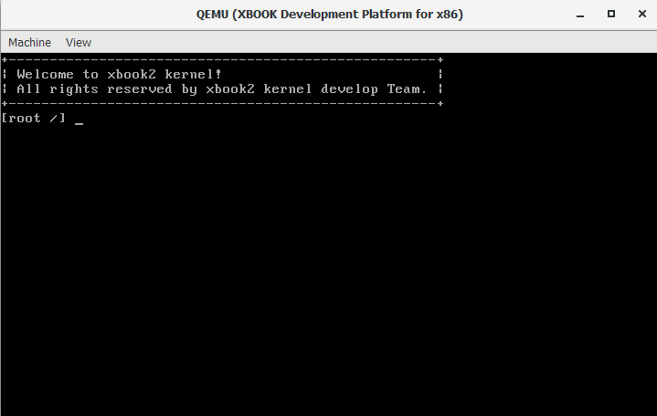

# x86-qemu平台上手指南

本文档将介绍如何在qemu虚拟机中启动运行xbook2内核。

## qemu介绍

QEMU是一套由[法布里斯·贝拉](https://baike.baidu.com/item/法布里斯·贝拉/9358492)(Fabrice Bellard)所编写的以[GPL](https://baike.baidu.com/item/GPL)许可证分发源码的模拟处理器，在[GNU/Linux](https://baike.baidu.com/item/GNU%2FLinux)平台上使用广泛。它可以模拟x86,x64,arm,riscv等处理器。我们这里使用的是qemu的x86模拟器版本。

## 准备工作

### 一. Windows环境搭建

1.下载我提取的工具包：[BuildTools](https://gitee.com/hzc1998/bookos-web-db/blob/master/tools/BuildTools.zip), 下载后配置解压目录环境变量到系统环境变量Path里面。（注意，如果你的电脑上已经有mingw或者cygwin环境，请把这个工具包的环境变量放到靠前的位置，不然不会执行工具包里面的程序）。

除此之外，由于支持了grub，所以需要单独的配置grub的工具环境，也是在BuildTools里面的。所以需要配置环境变量的目录如下：

```
BuildTools
BuildTools/genisoimage
BuildTools/grub-2.04
BuildTools/mkfs
BuildTools/mtool
```


！注意，如果你的环境中有gcc的编译环境，则需要吧BuildTools放在最前面。

2.下载qemu最新版：[Qemu](https://www.qemu.org/) 下载后安装，配置安装目录环境变量到系统环境变量Path里面，或者下载我提取的版本：[Qemu-i386](https://gitee.com/hzc1998/bookos-web-db/blob/master/tools/Qemu-i386.rar)，下载后配置解压目录环境变量到系统环境变量Path里面。

3.如果想要用虚拟机加速，下载windows下面的qemu加速扩展程序[HAXM](https://github.com/intel/haxm/releases) v7.6.5，下载后安装即可。

### 二、Linux环境搭建

```bash
#1.安装gcc, nasm: 
  Ubuntu/Kali Linux: sudo apt-get install gcc nasm truncate
  Red hat/Fedora/Centos: sudo yum install gcc nasm truncate

#2.安装qemu虚拟机：
  Ubuntu/Kali Linux: sudo apt-get install qemu-system-x86
  Red hat/Fedora/Centos: sudo yum install qemu-system-x86  

#3.安装grub引导相关工具：
  Ubuntu/Kali Linux: sudo apt-get install grub
  Red hat/Fedora/Centos: sudo yum install grub
```

### 三、Mac环境搭建

```bash
# 1.安装 i386-gcc
brew tap nativeos/i386-elf-toolchain
brew install i386-elf-binutils i386-elf-gcc

# 2.安装 truncate nasm qemu 
brew install truncate nasm qemu

# 3.安装 grub 
brew install grub
```

### 四、温馨提示！

1. 如果遇到工具链编译链接时出错，可以尝试到[FAQS.md](FAQS.md)文件中寻找解决方案。

2. 如果需要开启加速，需要将xbook2/Makefile中的QEMU_KVM := # no virutal注释掉，在最前面加一个#就可以了，变成#QEMU_KVM := # no virutal。

## 初识xbook2

首先，我们先看一下目录结构，了解一下代码构造。


| 目录名  |            描述            |
| :-----: | :------------------------: |
|   bin   |         可执行程序         |
| develop |  开发时生成的一些临时文件  |
|   doc   |         基础的文档         |
|  libs   |           基础库           |
|  sbin   |     管理员的可执行程序     |
| scripts | 一些makefile脚本和配置脚本 |
|   src   |     xbook2内核的源代码     |
|  tools  |       常用的一些工具       |

接下来进入src看看内核源码构造。


| 目录名  |           描述           |
| :-----: | :----------------------: |
|  arch   |      处理器平台相关      |
| drivers | 驱动目录（平台无关驱动） |
|   fs    |         文件系统         |
| include |        内核头文件        |
|  init   |        初始化程序        |
|   ipc   |        进程间通信        |
| kernel  |       内核其它模块       |
|   lib   |     内核使用的一些库     |
|   net   |         网络模块         |
|  task   |   多任务（进程/线程）    |
|   vmm   |       虚拟内存管理       |

## 编译运行

```bash
make build    # 构建环境
make run      # 编译并运行，默认使用qemu虚拟机运行
或者
make build -j8    # 构建环境，8线程编译，加快项目编译速度
make run -j8      # 编译并运行，默认使用qemu虚拟机运行
```

如果环境搭建没有问题，那么当以上命令执行完成后就可以看到xbook2在qemu中运行了。





